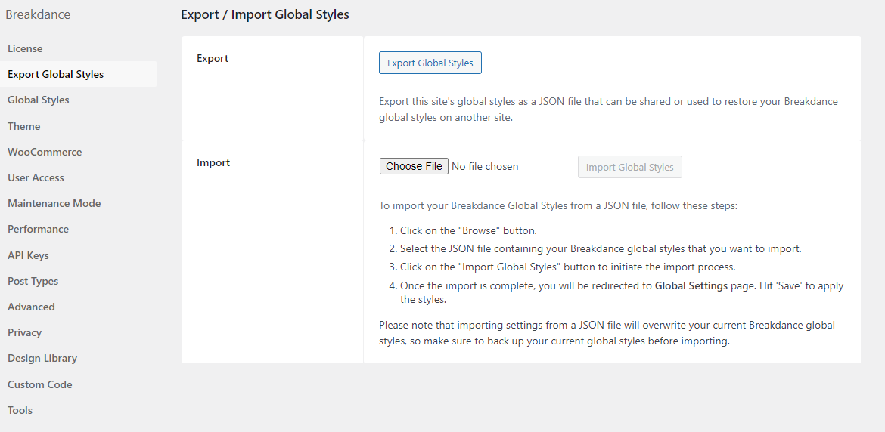

# Breakdance Global Styles JSON Export WordPress Plugin

## Overview

The **Breakdance Global Styles JSON Export** WordPress plugin allows users to export and import their Breakdance global styles configuration in JSON format. This can be useful for backup purposes or when transferring configurations between WordPress installations.

## Features

- **Export Global Styles:** Easily export your Breakdance global styles configuration to a JSON file.
- **Import Global Styles:** Import global styles by uploading a valid JSON file.

## Installation

1. Download the plugin ZIP file [here](https://github.com/alvindcaesar/breakdance-global-styles-json-export/releases/download/1.0.0/breakdance-global-styles-json-export.zip).
2. Log in to your WordPress admin dashboard.
3. Navigate to **Plugins > Add New**.
4. Click on the **Upload Plugin** button, select the ZIP file, and click **Install Now**.
5. Activate the plugin after installation.

## Usage

### Export Global Styles

1. In the WordPress admin dashboard, go to **Breakdance > Settings**.
2. Navigate to the **Export Global Styles** tab.
3. Click the **Export Global Styles** button.
4. A JSON file will be generated and downloaded to your computer.

### Import Global Styles

1. In the WordPress admin dashboard, go to **Breakdance > Settings**.
2. Navigate to the **Export Global Styles** tab.
3. Choose the JSON file containing your global styles configuration.
4. Click the **Import Global Styles** button to import the styles.

**Note:** Ensure that the Breakdance plugin is installed and activated before using this extension. If the Breakdance plugin is not active, the export/import functionality will not be available.

## Support

For any issues, questions, or feature requests, please [open an issue on GitHub](https://github.com/alvindcaesar/breakdance-global-styles-json-export/issues).

## Changelog

### 1.0.0

- Initial release.

## Contribution

Contributions are welcome! Feel free to submit a pull request.

## Screenshots

## Credits

This plugin is developed by Alvind Caesar.

Thank you for using the Breakdance Global Styles JSON Export WordPress plugin!
